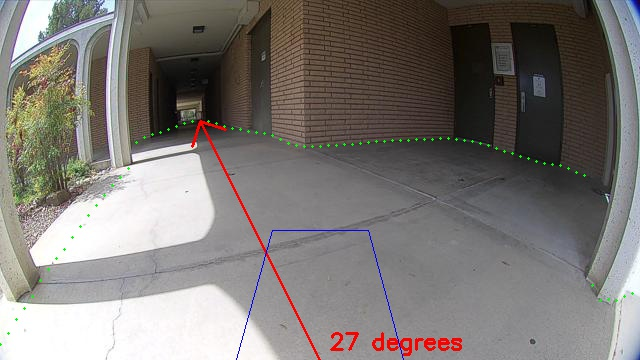

# **Senior Project**
Winter/Spring 2021

Dr. John Seng

Hunter Trick, Saehej Kang, Christian Aboud
***


# Data Collection

## Description
The purpose of this project is to develop a machine learning model that takes an image taken by a moving robot (Herbie) and highlights the path in the photo that Herbie can drive on. This is done by: 
1.	Converting the image into a mask. The mask is represented by a line separating where the robot can and cannot drive. 
2.	Generate coordinates for each mask. Each image has the output (x, y) coordinates, with *x* being the column coordinate (left-to-right), and *y* being the distance from the top of the image normalized between 0 and 1 (0=top of image, 1=bottom of image). 
3.	Overlay the mask coordinates onto the original image as green circles to visually display where the robot would be able to walk in this image. 
4.	Using the original images as input, and the overlayed images as valid outputs, we now have a dataset to begin training the model to predict mask points for new images. 


## Requirements
```
python3
PIL >= 7.0.0
opencv-python >= 4.1.2
numpy >= 1.17.2
```

## dataExtractor.py

* -labelbox: The name of the data file to download and extract image and mask data from if using a LabelBox file
* -scale: The name of the data file(s) to download and extract image and mask data from if using a scale.ai file
* -clean: A flag argument to remove all the directories and files containing image data, a way to 'clean' all directory
* -a: A flag argument to re-download all of the images from the given data file that follows
* -n: A flag argument to skip already downloaded images and their associated data and download any new images and their associated data from the given data file that follows
* -p: An optional flag argument to use with -a or -n to specify what percentage of the downloaded images to set aside for validation, percentage is to be a float between 0-1.0. Default percentage is 0.15
* -c: A flag argument to specify the config file to use to determine the height and width of the images to save, and the number of points to extract from the image masks
* -warnings: Show warnings for potential polygon errors
```
"Usage: python3 dataExtractor.py [-clean] [-a] [-n] -p [0-1] -labelbox [filename.csv] -scale [filename(s).json] -c [filename] [-warnings]"
``` 
```
python3 dataExtractor.py -a -labelbox labelbox_small_export.csv -scale scaleai.json -c config

python3 dataExtractor.py -a -scale labelme_hdr.json labelme_sdr.json -labelbox labelbox_small_export.csv -c config

python3 dataExtractor.py -n -c -p .90 -labelbox labelbox_small_export.csv -scale scaleai.json
```

Sample command to run a complete download of all images (labelme, Labelbox, and scale.ai):

```
python3 dataExtractor.py -a -p .05 -scale labelme_hdr.json labelme_sdr.json scaleai.json -labelbox labelbox_full_export.csv -c config
```

## labelme_to_scaleai.py
Generates a JSON file in the format of scale.ai data based on a LabelMe dataset provided as a URL

```
usage: labelme_to_scaleai.py URL [destination]
```

Example:
The following command would download all images from the URL into a single file named "labelme.json" (default destination)
```
python3 labelme_to_scaleai.py http://users.csc.calpoly.edu/\~jseng/scale_ai_image/labelme/dataset_hdr
```

## labelbox.py, scale_ai.py
Two classes that provide functions used in dataExtractor.py to parse the file format for labelbox and scale.ai data

## Config File

### **model**
Argument|Description|Type|Default
---|---|---|---
input_width|Input width of model|int|640
input_height|Input height of model|int|360
num_outputs|Number of points generated to define the boundary of free space|int|128


## Directories
The images and their mask data gathered from the dataExtractor.py script are stored in the following directories and .txt files. All directories and files are stored relative the path where the dataExtractor.py script was called from.
* **Input_Images**: Stores a copy of the original image to be used for input.
* **Image_Masks**: Stores a copy of all the masks associated with each of the input images.
* **Mask_data**: Stores .txt files for all of the image masks with the output points extracted from the respective image's mask stored in x,y column format. Each y in the data is normalized to between 0 and 1 (0=top of image, 1=bottom of image).
* **Mask_Validation**: Stores a copy of each input image with the extracted output points from the image's mask overlaid as green circles to validate the correct data is extracted from the mask.
* **Training_Images**: Stores a copy of the original input images that are to be used for training.
* **Validation_Images**: Stores a copy of the original input images that are to be used for validation.
* **Model_Prediction**: Stores a copy of the predictions made by the model for each of the images in the "image_path" directory in the config file used.


# PyTorch Network

## Description
Pytorch is the neural network implementation we used to train a model that marks the driveable regions in an image. The regions are indicated by dots overlayed on the image itself; from there, we can calculate the direction and turn angle the robot should take in its current state. 
## Setup
It is best to first setup a Python virtual environment before running PyTorch.  A virtual environment will download all the Python packages into a local environment directory and prevent those packages from affecting your local Python installation.  Use the following command to setup your virtual environment (you will need to do this only once, and it will create the directory ``pt-env``):

```
python3 -m venv pt-env
```

Once your environment is setup, you will need to activate it each time you want to use that local Python installation:

```
source pt-env/bin/activate
```

Then, install the necessary packages:

```
pip3 install torch torchsummary torchvision albumentations timm
```

## Working with the training/testing scripts

To train the model run

```
python3 train.py
```

To run the inference script (which will create new images in the ``Inference_Images`` directory):

```
python3 inference.py model_name.pt [-trajectory]
```

To overlay the trajectory information on the inference images, use the optional ``-trajectory`` flag. This will display the width of the robot for three feet in front of the camera, as well as the direction and angle to drive. If something is immediately blocking the robot, it will turn to the left or right. Otherwise, it will drive to the furthest point away.

To compute the variance of all models in the ``models`` directory using the images in the ``Unlabeled`` directory, run the inference script with the ``-variance`` flag. The output file will be named ``variance.csv``.

```
python3 inference.py -variance
```

Example output inference image with trajectory

